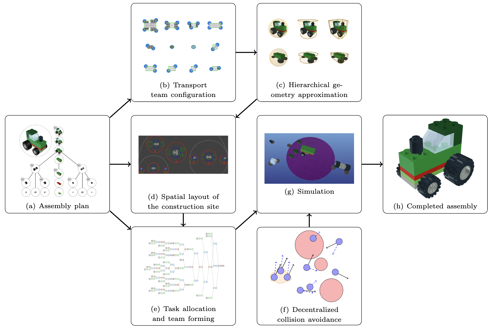
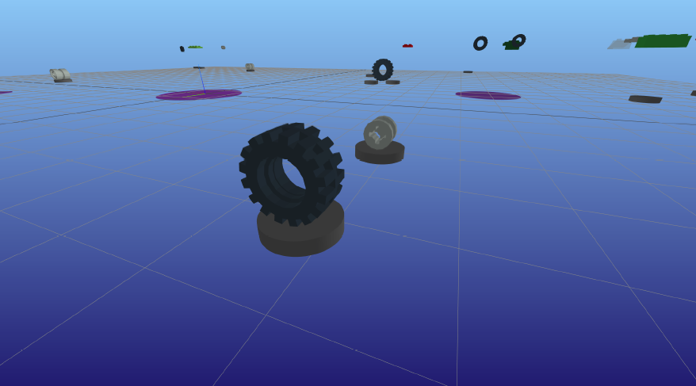
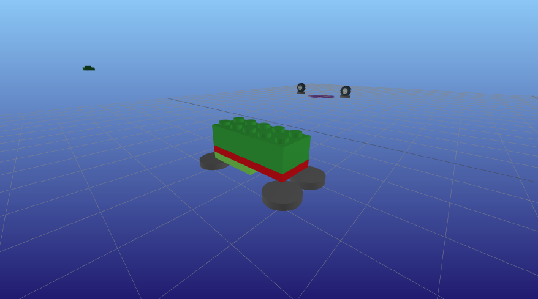
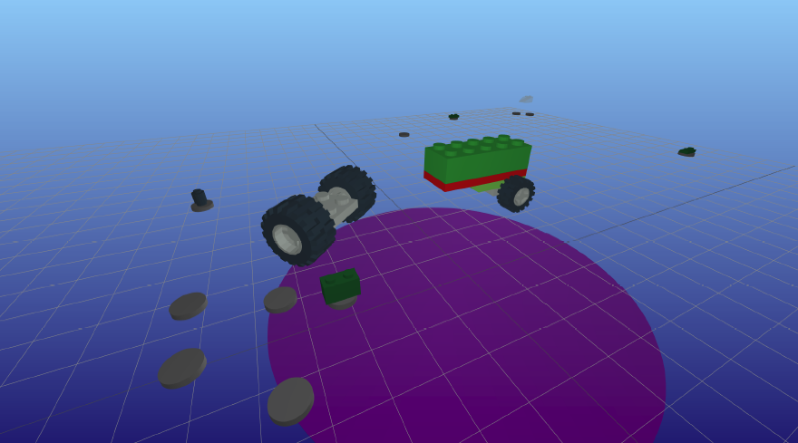
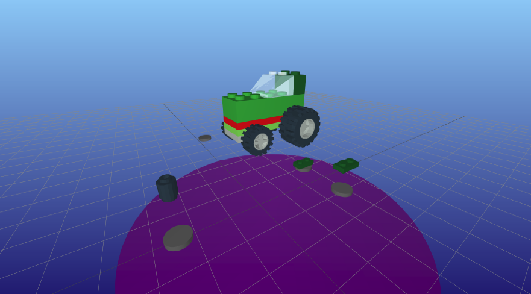

# ConstructionBots.jl

[](https://sisl.github.io/ConstructionBots.jl/stable)
[](https://github.com/sisl/ConstructionBots.jl/actions)



[arXiv paper](https://arxiv.org/abs/2311.00192)

ConstructionBots.jl is an open-source multi-robot manufacturing simulator and is designed to test algorithms for multi-robot assembly planning. This system approaches multi-robot assembly planning from a higher level of abstraction and addresses task planning and transit planning but abstracts away the kino-dynamic details of piecing together assemblies. Problems addressed and simulated:
- **Trasport Team configuration:** How many robots are needed and how should robots be positioned when transporting a particular payload?
- **Spatial layout of the construction site:** Where will each assembly be built, and where will the components of those assemblies be delivered?
- **Sequential task allocation and team forming:** Which robots will collect and deliver which payloads? Wince there are generally far more payloads than robots, individual robots generally have to transport multiple payloads in sequence.
- **Collision avoidance with heterogeneous agent geometry and dynamics:** How must laden and unloaden robots and robot teams move, subject to motion constraints that depend on the payload size and team configuration, to avoid collision with other robots and the active construction sites in the environment?

ConstructionBots ueses LEGO models to evaluate algorithms. LEGO models offer a convenient framework for defining large assemblies that are often composed of smaller assemblies in addition to individual parts. ConstructionBots uses assemblies that are defined using the LDraw file specification, an open-source tool for describing LEGO bricks and models.

## Hosted Demos to View the Functionality of ConstructionBots
| Project | Allocation Algorithm | RVO | Dispersion  | Tangent Bug | Visualization |
| --- | :---: | :---: | :---: | :---: | :---: |
| Tractor | Greedy | Yes | Yes | Yes | [Link](https://sisl.github.io/ConstructionBots.jl/stable/tractor_greedy_RVO_Dispersion_TangentBug_visualization.html) |
| Tractor | MILP | Yes | Yes | Yes | [Link](https://sisl.github.io/ConstructionBots.jl/stable/tractor_milp_RVO_Dispersion_TangentBug_visualization.html) |
| AT-TE Walker  | MILP + Greedy | Yes | Yes | Yes | [Link](https://sisl.github.io/ConstructionBots.jl/stable/atte-walker_milp-ws_RVO_Dispersion_TangentBug_visualization.html) |
| X-Wing  | Greedy | No | No | No | [Link](https://sisl.github.io/ConstructionBots.jl/stable/x-wing_greedy_no-RVO_no-Dispersion_no-TangentBug_visualization.html) |

## Installation

### ConstructionBots
To interact with ConstrucitonBots, it is recommended you clone this repository and instantiate the environment.
```bash
git clone https://github.com/sisl/ConstructionBots.jl.git
cd ConstructionBots.jl
julia
```
```julia
julia> ] activate .
pkg> instantiate
pkg> build
```

### LDraw Parts Library
Individual part geometry is needed for all features. The parts library can be downloaded from [LDraw™ Parts Library](https://library.ldraw.org/updates?latest). Place the unzipped library in your desired path. The default path assumed by LDrawParser is `joinpath(homedir(), "Documents/ldraw")`. It is recommended to download the complete library (~80 MB zipped, ~450 MB unzipped). If you did not place the parts library in the default path, you can change the path LDrawParser uses by the `set_part_library_dir!` command.

### RVO
The RVO2 library is used for collision avoidance. ConstructionBots uses a Python API to interact with RVO2 library. The modified version of RVO2 that integrates dynamic priorities can be found at https://github.com/sisl/Python-RVO2.

To install the RVO2 library:
```bash
conda create -n lego_rvo2 python=3.7 anaconda
conda activate lego_rvo2
conda install pip
pip install cython==0.29.36
git clone https://github.com/sisl/Python-RVO2.git
cd Python-RVO2
python setup.py build
python setup.py install
```
Once you have the RVO2 library built, you need to set the path to the appropriate environment for PyCall to find the RVO2 library. In the Julia REPL, run the following:
```julia
julia> ENV["PYTHON"] = "path/to/lego_rvo2/bin/python3.7" # e.g. ~/miniconda3/envs/lego_rvo2/bin/python3.7
julia> using Pkg
julia> Pkg.build("PyCall")
```

Restart Julia and run the following to test the installation of the RVO2 library:
```julia
julia> using PyCall
julia> rvo = pyimport("rvo2")
```

## Usage
This repository comes with demos to demonstrate the functionality of ConstructionBots. To run the demos, run the following in the Julia REPL:
```julia
julia> include("scripts/demos.jl")
```
The default demo is the a Tractor based on LEGO model 10708, Green Creativity Box. The tractor model has a total of 20 individual pieces, which are organized into one final assembly (the tractor) and seven subassemblies. The demo is configured to use 10 robots to assemble the tractor. The collision avoidance algorithms are not used and it should open an interative visualization of the assembly process in your brower. The demo can be configured by changing the parameters in [`demos.jl`](https://github.com/sisl/ConstructionBots.jl/blob/master/scripts/demos.jl). Examples of the simulation are shown below.
You can interact with an example from the tractor simulation [here](https://sisl.github.io/ConstructionBots.jl/stable/tractor_greedy_no-RVO_no-Dispersion_TangentBug_visualization.html).
The main function for the demo is [`run_tractor_demo`](https://github.com/sisl/ConstructionBots.jl/blob/c7dcb3baabc437cfccd12e8ccc777e1561e9bf3b/src/full_demo.jl#L48) in [`full_demo.jl`](https://github.com/sisl/ConstructionBots.jl/blob/master/src/full_demo.jl).

If the demo setting `update_anim_at_every_step` is not set to `true`, then the animation will only update at the completion of nodes in the schedule. This setting results in faster processing times for the animation, but results in entities taking straight paths between updates. Therefore, it appears that collisions occur between entities. If collision avoidance is enabled and you want to see the collision avoidance in action (with no missed steps), set `update_anim_at_every_step` to `true`. Note, this increases processing time quite a bit.

### Images from the Tractor Project








## Citation
Under review

[arXiv paper](https://arxiv.org/abs/2311.00192)

```
@article{Brown2023Assembly},
title = {Large-Scale Multi-Robot Assembly Planning for Autonomous Manufacturing},
author = {Kyle Brown and Dylan M. Asmar and Mac Schwager and Mykel J. Kochenderfer},
journal = {arXiv preprint arXiv:2311.00192},
year = {2023}
```
